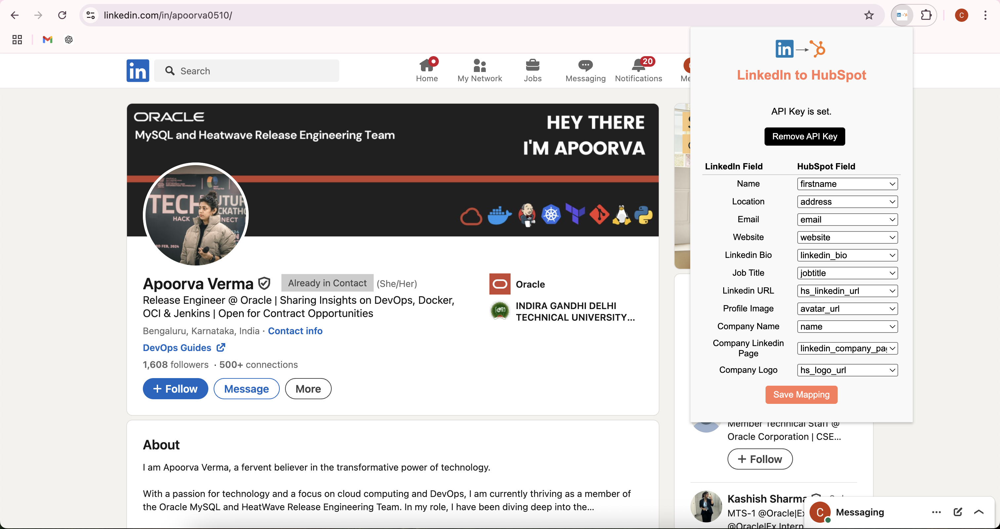

# Linked2HubSpot Chrome Extension

## Overview

**Linked2HubSpot** is a Chrome extension that helps you extract data from LinkedIn profiles and send it directly to HubSpot as contacts and companies. It provides a simple UI for mapping LinkedIn fields to HubSpot fields and manages associations between contacts and companies automatically.

## Features

- Extracts profile data from LinkedIn profiles with human-like interaction.
- Lets you map LinkedIn fields to HubSpot fields via a popup UI.
- Stores your HubSpot API key securely in Chrome storage.
- Associates contacts with companies in HubSpot.
- Notifies you if a LinkedIn profile is already in HubSpot.
- Provides visual feedback (snackbar) on success or failure.

## How it Works

1. **Install the Extension:**  
   Load the unpacked extension in Chrome.

2. **Set Your HubSpot API Key:**  
   Open the extension popup and enter your HubSpot API key.

3. **Map Fields:**  
   Use the mapping table in the popup to map LinkedIn fields to HubSpot fields as needed.

4. **Visit a LinkedIn Profile:**  
   On any LinkedIn profile page, click the "Add to HubSpot" button that appears next to the profile name.

5. **Automatic Association:**  
   The extension will create or update the contact and company in HubSpot, and associate them.

## UI

The extension popup looks like this:

## Requirements

- Chrome browser
- HubSpot API key

## Security

- Your API key is stored locally in Chrome's extension storage.
- No data is sent anywhere except to HubSpot via their official API.

## License

MIT License
